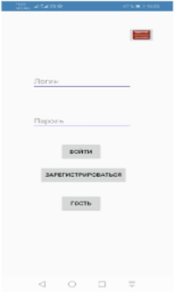
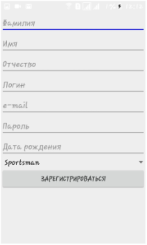
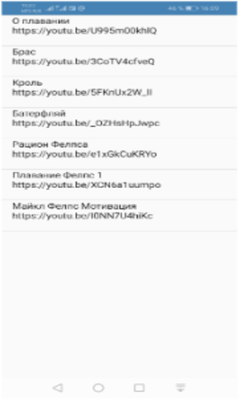

# 🏊 SwimmingTraining

<p align="center">
  
  
  
</p>

<p align="center">
  Mobile application for planning and tracking swimming workouts.
</p>

---

# 📱 About Project

SwimmingTraining is an Android application designed for swimmers and athletes.
The app helps users:

* create swimming workouts,
* track training progress,
* monitor distance and time,
* improve discipline and performance.

This project is being developed as part of Android development practice and portfolio building.

---

# ✨ Features

✅ Create workouts
✅ Training history
✅ Track distance and time
✅ Simple and clean UI
✅ Local data storage
🚧 Statistics and charts
🚧 Firebase sync
🚧 Notifications and reminders

---

# 📸 Screenshots

<p align="center">
  
  
  
</p>

> Replace placeholder images with real screenshots from the application.

---

# 🛠 Tech Stack

* Java
* Android SDK
* XML Layouts
* Gradle
* Firebase
* NoSQL Database
* GitHub

---

# 📚 Development Tools

| Tool           | Description                                |
| -------------- | ------------------------------------------ |
| Android Studio | Main IDE for Android development           |
| Java           | Core programming language                  |
| Firebase       | Backend and cloud services                 |
| NoSQL          | Flexible data storage system               |
| XML            | UI layout creation                         |
| GitHub         | Version control and repository hosting     |
| Gradle         | Build automation and dependency management |

---

# 🧱 Architecture

Current architecture:

* Activities
* XML Layouts
* Local storage

Planned improvements:

* MVVM
* Room Database
* Retrofit
* Firebase
* Hilt Dependency Injection

---

# 🚀 Installation

## Clone repository

```bash
git clone https://github.com/MussaPortfolio/SwimmingTraining.git
```

## Open project

1. Open Android Studio
2. Click **Open**
3. Select project folder
4. Wait for Gradle sync
5. Run application on emulator or Android device

---

# 📂 Project Structure

```text
SwimmingTraining/
│
├── app/
├── gradle/
├── build.gradle
├── settings.gradle
└── README.md
```

---

# 🗺 Roadmap

* [ ] User authentication
* [ ] Workout timer
* [ ] Statistics dashboard
* [ ] Push notifications
* [ ] Dark theme
* [ ] Firebase synchronization
* [ ] Cloud backup
* [ ] Export workout history

---

# 🎯 Purpose

The main goal of this project is:

* improve Android development skills,
* practice mobile UI creation,
* learn app architecture,
* build a strong portfolio project.

---

# 👨‍💻 Author

GitHub: [https://github.com/MussaPortfolio](https://github.com/MussaPortfolio)

---

# ⭐ Support

If you like this project, give it a star on GitHub ⭐
