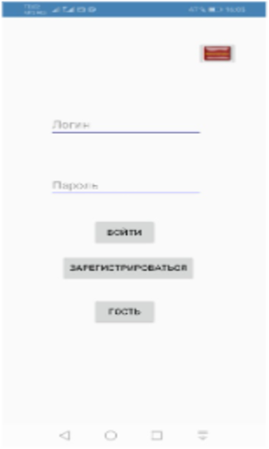
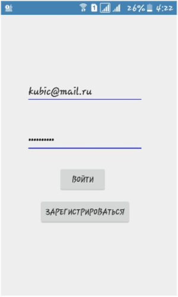
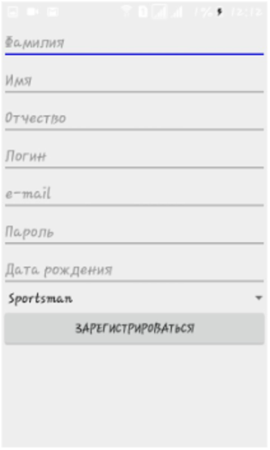

# 🏊 SwimmingTraining


Android-приложение для взаимодействия тренеров по плаванию и спортсменов: обмен видео тренировок, запросы тренеру и переписка.

## 📱 Возможности

**Спортсмен**
- регистрация и вход, просмотр списка тренеров и профилей
- отправка запроса тренеру
- загрузка видео тренировок (Firebase Storage)
- переписка с тренером
- рейтинг

**Тренер**
- список спортсменов и их профили
- просмотр видео спортсменов
- обработка входящих запросов
- переписка со спортсменами

**Гость** — просмотр списка тренеров без входа.

**Администратор** — отдельный вход и панель управления.

Роль пользователя (`Sportsman` / `Trainer`) хранится в Realtime Database (`users/{uid}/rol`) и определяет, какой экран откроется после входа.

## 📸 Скриншоты

<p align="center">
  
  
  
</p>

## 🛠 Технологии

- Java, Android SDK (minSdk 19, targetSdk 28)
- Android Support Library 28, XML-разметка
- Firebase Authentication, Realtime Database, Storage
- Gradle

## 🧱 Архитектура

Сейчас вся логика находится в Activity и фрагментах, пакет `com.example.swimmingtraining` плоский.

Планы: миграция на AndroidX, MVVM, вынос строк в `strings.xml`, слой репозиториев для Firebase.

## 🚀 Запуск

```bash
git clone https://github.com/MussaPortfolio/SwimmingTraining.git
```

1. Откройте проект в Android Studio и дождитесь синхронизации Gradle.
2. Подключите свой Firebase-проект: замените `app/google-services.json` и включите Email/Password Auth, Realtime Database и Storage.
3. Настройте правила базы данных и хранилища так, чтобы доступ был только у авторизованных пользователей.
4. Запустите на эмуляторе или устройстве.

## 🗺 Roadmap

- [ ] Миграция на AndroidX и актуальные версии Firebase
- [ ] Безопасный вход администратора (Firebase Auth + правила БД)
- [ ] Отписка от слушателей Firebase, устранение дублирования кода
- [ ] Тесты
- [ ] Push-уведомления
- [ ] Тёмная тема

## 👨‍💻 Автор

[MussaPortfolio](https://github.com/MussaPortfolio)
